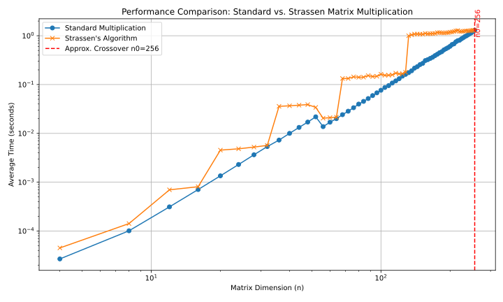

# Strassen-25
This repository contains a document describing an optimzation of **Strassen**'s algorithm, **Strassen-25**, with a runtime of $O\left(n^{2.3219}\right)$. It also contains a simple Python project implementing the **Strassen** algorithm and required data structures. It also provides some documentation theory inside doc/. Experiments were conducted for original matrix multiplication in comparison to **Strassen** matrix multiplication. Interesting to observe that the first $n_0$ for which **Strassen** is faster than the original multiplication is $n = 132$ (Ubuntu 24.04.2. LTS, AMD Ryzen 5 7520U × 8 with 4384.00 MHz, RAM: 7.01 GB). Have a look at the plot of the experimental results:

In general, for this specific Python implementation, with STRASSEN_INTERNAL_THRESHOLD set to 32, **Strassen** does not provide a performance benefit over standard matrix multiplication within the tested range of $n = 4$ to $n = 256$. The overhead associated with recursive calls, matrix splitting/joining, and especially the padding for non-power-of-two dimensions, makes it consistently slower. To observe **Strassen**'s potential advantage, the experiment might need to test larger $n$ values (e.g., $n = 512,1024,2048, \ldots $). Side note: when starting experiment conduction there was a cross for $n = 256$, but during 5 experiment repititions no further cross was observed (Python got warm ;).

For $n = 56$, both the original and **Strassen's** matrix multiplication ran faster than for previous $n < 56 = 7 \cdot 8$. **Strassen's** method uses 7 matrix multiplications, meaning 14 sub-matrices. What if 15 sub-matrices or structures were used for a faster matrix multiplication than Strassen's? The idea is to find 15 sub-matrices or structures within the two $n \times n$ matrices to improve **Strassen's** runtime. To do this, consider the diagonal of matrix $B$ to perform only 5 instead of 7 matrix multiplications. It holds that $ce$ can be calculated with $P_6$, $de$ with $P_1$, $ah$ with $P_1$, and $bh$ with $P_7$ earlier in **Strassen's** algorithm, so that two matrix multiplications can be saved. Since only 5 matrix multiplications are required, the result of the runtime analysis can be reused with the difference that:

$$
\begin{aligned}
T(n) &= 5^{\log_{2}n} \quad T\Big(\frac{n}{2^{\log_{2}n}}\Big) + cn^2 \sum_{i = 0}^{\log_{2}n-1} \left(\tfrac{5}{4}\right)^i \\
&= n^{\log_{2}5} \quad T(1) + cn^2 \frac{\left(\tfrac{5}{4}\right)^{\log_{2}n} - 1}{\tfrac{5}{4} - 1} \\
&= O\left(n^{2.3219}\right).
\end{aligned}
$$